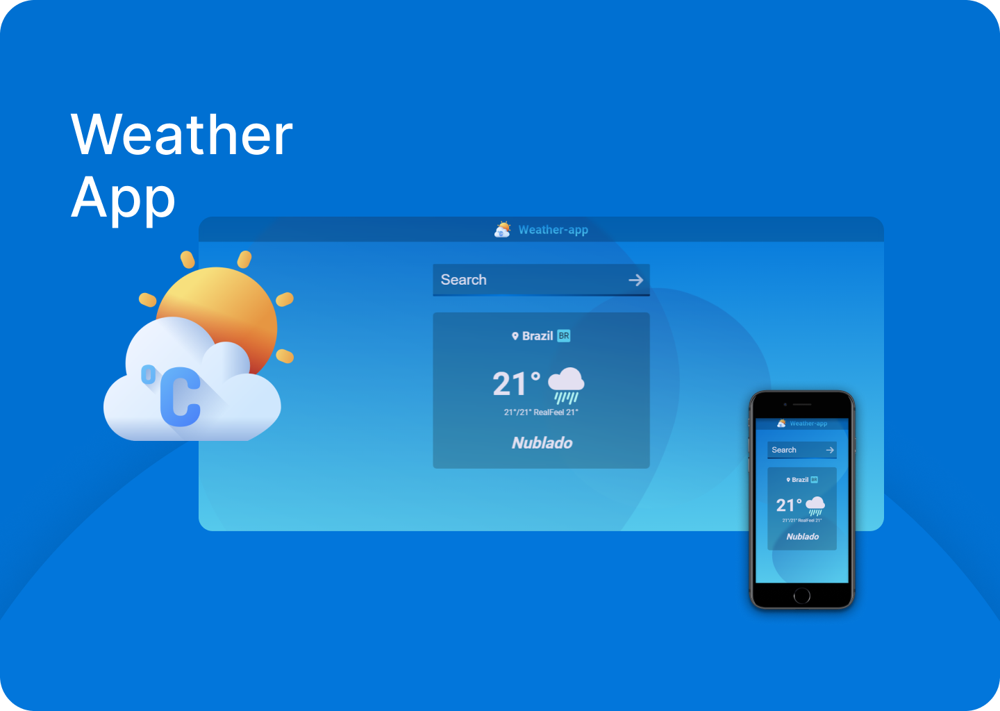

<div align="center">

# weather-app

</div>

| Template 🚀 |
| :---------: |

| 

<p align="center">
  &nbsp;&nbsp;&nbsp;|&nbsp;&nbsp;&nbsp;
  <a href="#-license">License</a>&nbsp;&nbsp;&nbsp;|&nbsp;&nbsp;&nbsp;
  <a href="#-technologies">Technologies</a>&nbsp;&nbsp;&nbsp;|&nbsp;&nbsp;&nbsp;
  <a href="#-features">Features</a>&nbsp;&nbsp;&nbsp;|&nbsp;&nbsp;&nbsp;
  <a href="#-getting-started">Getting Started</a>&nbsp;&nbsp;&nbsp;|&nbsp;&nbsp;&nbsp;
  <a href="https://weather-webapp-tech.vercel.app/">Deploy</a>&nbsp;&nbsp;&nbsp;|&nbsp;&nbsp;&nbsp;
  <a href="https://www.figma.com/file/UeIgMUVdOvuVhbWXcR68zi/DD-%2F-Countdown-(Copy)?node-id=0%3A1">Layout</a>&nbsp;&nbsp;&nbsp;|&nbsp;&nbsp;&nbsp;
</p>

<p align="center">
  A weather application to get the temperature, weather condition and whether it is day or night of a particular city using OpenWeatherMap. A free weather api.
  <br><br>
  <a href="./LICENSE">
      
  </a>
</p>

## 📈 Features

<!-- ❌✅ -->&nbsp;&nbsp;&nbsp;

1. ✅ Use any weather API
2. ✅ Enter the name of a city into the input field.
3. ✅ By pressing enter, the user submits the name of the city which updates the DOM with the temperature, weather condition, image of day or night and weather condition icon.
4. ✅ By closing the browser window the city name will be stored in localStorage and when the user returns, the name will be retrieved to make an api call to update the DOM.
5. ❌ axios
6. ❌ bootstrap.

## 🛠 Technologies


## 💻 Getting started

```git
git clone https://github.com/joaovic-tech/weather-app.git
```

## 📃 License

This project is under the MIT license. See the [LICENSE](LICENSE) file for more details.

---

Made with 💜 by [joaovic-tech](https://github.com/joaovic-tech)
